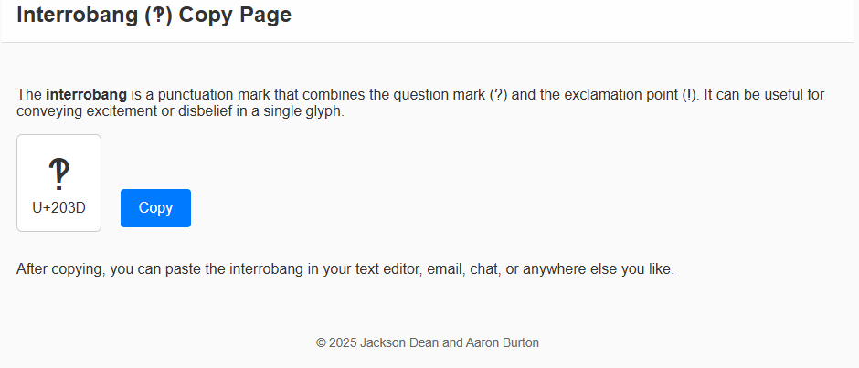

# Interrobang Copy Page

A minimal single-page site that lets you copy the interrobang symbol (‽) to your clipboard with one click.



---

## Table of Contents

- [About](#about)
- [Features](#features)
- [Getting Started](#getting-started)
  - [Local Development](#local-development)
- [Deployment to GitHub Pages](#deployment-to-github-pages)
- [Contributing](#contributing)
- [License](#license)

---

## About

The **Interrobang Copy Page** is a fun little web page inspired by degreesymbol.net In this case, the special symbol is the interrobang (U+203D), which looks like: `‽`.

Whether you’re writing an excited rhetorical question or just want to add flair to your text, the interrobang can be a neat punctuation mark to have on hand.

---

## Features

- **Copy Button**: One-click copy of the interrobang symbol to the clipboard.
- **Minimal Design**: Simple, responsive layout using just HTML, CSS, and a tiny bit of JavaScript.
- **Static Hosting**: Perfect for GitHub Pages or any static site host.

---

## Getting Started

### Local Development

1. **Clone this repository** (or download the source files):
   ```bash
   git clone https://github.com/yourusername/interrobang-copy-page.git
